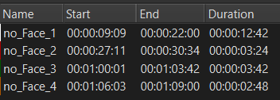

# Lip-sync video and audio using **Wav2Lip**

To create a lip-synced video of the target [video](https://www.youtube.com/watch?v=YMuuEv37s0o) and [audio](data/output10.wav) with the help of links provided in the given pdf.
Following is the link for the Pre- Trained model required in the first assignment: https://github.com/Rudrabha/Wav2Lip

Open in [[Colab Notebook]](https://colab.research.google.com/drive/15Ua7frL1UYcXoaj3uvFITl7X6X_rXl3s#scrollTo=uHNTCUKu1yJ0) or see [here](wav2lip_lip_sync_soln.ipynb)

## Wav2Lip:

[Wav2Lip](https://github.com/Rudrabha/Wav2Lip) is a lip-syncing algorithm that can be used to create videos of people talking, even if the audio is not originally from the device. It works by first detecting the face in the video and then generating frames that match the audio. The generated frames are then stitched together to create a new video.

---
From the pre-trained model **Wav2Lip** to lip-sync the any video to any audio.

- Clone the repo (as the below repo works well)

```git
git clone https://github.com/justinjohn0306/Wav2Lip
```

- Install the additional required libraries and in the repo's `requirements.txt`

```shell
!pip install -q pytube
!pip install ffmpeg-python mediapipe==0.8.11
!pip install -r requirements.txt
```

- Download the pre-trained models' weights from the below links or use the shell command below

| Model  | Description |  Link to the model | 
| :-------------: | :---------------: | :---------------: |
| Wav2Lip  | Highly accurate lip-sync | [Link](https://iiitaphyd-my.sharepoint.com/:u:/g/personal/radrabha_m_research_iiit_ac_in/Eb3LEzbfuKlJiR600lQWRxgBIY27JZg80f7V9jtMfbNDaQ?e=TBFBVW)  |
| Wav2Lip + GAN  | Slightly inferior lip-sync, but better visual quality | [Link](https://iiitaphyd-my.sharepoint.com/:u:/g/personal/radrabha_m_research_iiit_ac_in/EdjI7bZlgApMqsVoEUUXpLsBxqXbn5z8VTmoxp55YNDcIA?e=n9ljGW) |

```shell
!wget 'https://github.com/justinjohn0306/Wav2Lip/releases/download/models/wav2lip.pth' -O 'checkpoints/wav2lip.pth'
!wget 'https://github.com/justinjohn0306/Wav2Lip/releases/download/models/wav2lip_gan.pth' -O 'checkpoints/wav2lip_gan.pth'
!wget 'https://github.com/justinjohn0306/Wav2Lip/releases/download/models/resnet50.pth' -O 'checkpoints/resnet50.pth'
!wget 'https://github.com/justinjohn0306/Wav2Lip/releases/download/models/mobilenet.pth' -O 'checkpoints/mobilenet.pth'
a = !pip install https://raw.githubusercontent.com/AwaleSajil/ghc/master/ghc-1.0-py3-none-any.whl
!pip install git+https://github.com/elliottzheng/batch-face.git@master
```

- Download the target video using `pytube`

```python
# Downloading the target YouTube video using pytube
# URL - https://www.youtube.com/watch?v=YMuuEv37s0o
import pytube
yt_url = input("Enter the YouTube URL: ")
video = pytube.YouTube(yt_url)
streams = video.streams
stream = streams.filter(res='720p').first()
stream.download(output_path='/content/drive/MyDrive/Wav2Lip/input_videos/')
```

After downloading the target video from YouTube with 720p, and we have to trim the video using any video editing softwares as because the [audio file](data/output10.wav) is of duration _1 minute 7 seconds_. And we have to trim the video as well because the model wants the face image in all the video frames, the below fig. is marked  the all non-face images in the videos and we can see the duration of each of it, finally after [**trimmed** the video](data/trimmed_input_video.mp4) its duration is _1 minute 2 seconds_.



Also, we have to **trim** the [audio data](data/trimmed_input_audio.wav) as well with respect to the non face images in the video (As this approach will loss some information or mismatch of context)

### Inference

```shell
python inference.py --checkpoint_path <ckpt> --face <video.mp4> --audio <an-audio-source> 
```

This [Drive link](https://drive.google.com/file/d/1_ohNk_JxndxUYtVVG_86DYLOgEhuAbCS/view?usp=sharing) has the HD video output file (720p) from the pre-trained **Wav2Lip + GAN** model, by leveraging the T4 GPU in Google Colab.

**Challenges**

- The generated result video is quite fair quality of lip-syncing, because of the author's face is moving around in the video makes the model to find the face frame to makes some jitters, to resolve this issue, we have to use better face-finding algorthims such as YOLO, RetinaFace, etc.,
- The context of the trimmed audio with the sync to the trimmed video may mismatch of context meaning.

_References:_
- Paper - https://arxiv.org/abs/2008.10010
- Code - https://github.com/Rudrabha/Wav2Lip
- Website - http://bhaasha.iiit.ac.in/lipsync/
